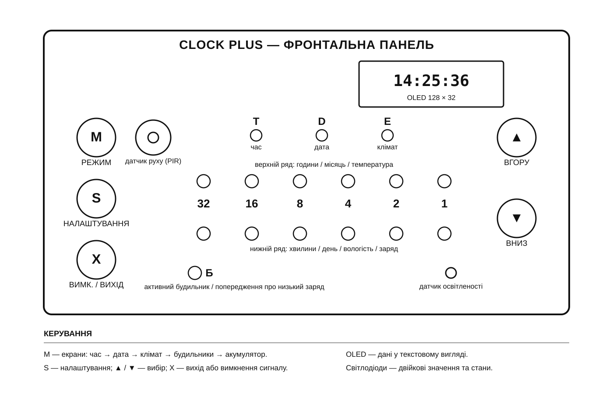

# Clock Plus

Посібник користувача для версії пристрою **Clock Plus Premium**.

Ця версія годинника має годинник реального часу з резервним живленням, OLED-екран 128x32, основний бінарний LED-індикатор, датчики температури, вологості, освітленості та руху, активний бузер і контроль заряду акумулятора.

Вайрфрейм нижче зроблено за наданою фотографією корпусу. Він показує органи керування та зони індикації; конкретна механіка корпусу може трохи відрізнятися.



## 1. Призначення пристрою

Clock Plus показує час, дату, температуру, вологість, заряд акумулятора і стан будильників. Пристрій уміє автоматично перемикати режими показу, регулювати яскравість LED-індикатора за рівнем освітленості, вимикати периферію за відсутності руху та зберігати хід годинника при зникненні основного живлення.

Основні функції:

- годинник реального часу зі збереженням ходу при резервному живленні;
- дата з урахуванням місяця та високосного року в діапазоні 2000-2099;
- три незалежні будильники;
- OLED-дублювання даних у текстовому вигляді;
- бінарна LED-індикація значень;
- автоматична яскравість LED-індикатора;
- датчик руху для гасіння та пробудження індикації;
- режим низького заряду акумулятора;
- глибокий енергозберігаючий режим при повному зникненні основного живлення.

## 2. Органи керування

На передній панелі використовуються п'ять логічних кнопок:

| Маркування | Назва | Дія |
| --- | --- | --- |
| `M` | MODE | Перемикає екран: час, дата, середовище, будильники, батарея |
| `S` | SET | Входить у налаштування поточного режиму або перемикає поле редагування |
| `▲` | UP | Збільшує значення або вибирає попередній пункт |
| `▼` | DOWN | Зменшує значення або вибирає наступний пункт |
| `X` | OFF / EXIT | Вихід із налаштування, зупинка будильника, перемикання будильника on/off |

Якщо будильник зараз пищить, будь-яка кнопка лише вимикає звук. Вона не виконує свою звичайну дію, поки сигнал будильника активний.

Довге утримання `OFF / EXIT` у режимі будильників перемикає всі налаштовані будильники одразу: якщо хоча б один увімкнений, усі налаштовані будуть вимкнені; якщо всі вимкнені, усі налаштовані будуть увімкнені.

## 3. Екрани та режими

Кнопка `MODE` перемикає ручні режими по колу:

`Time -> Date -> Environment -> Alarm -> Battery -> Time`

Автоматичний цикл показу працює тільки для основних інформаційних екранів:

`Time -> Date -> Environment -> Time`

Тривалість автоматичного показу:

| Екран | Тривалість |
| --- | --- |
| Time | 15 секунд |
| Date | 5 секунд |
| Environment | 5 секунд |

Після натискання будь-якої кнопки автоматичний цикл ставиться на паузу на 30 секунд. Якщо кнопку тримають довго, 30 секунд рахуються після відпускання. Коли пауза закінчиться, пристрій переходить до наступного екрана автоматичного циклу.

Якщо пристрій перебуває в режимі налаштування, через 1 хвилину без дій він виходить із налаштування так само, як при натисканні `OFF / EXIT`.

## 4. Основна LED-індикація

Основний LED-індикатор складається з двох рядів по 6 значущих світлодіодів:

`32 16 8 4 2 1`

Значення читається як сума світлодіодів, що горять. Наприклад:

- горять `16 + 8 + 2 + 1` = 27;
- горять `32 + 16 + 1` = 49;
- нічого не горить = 0.

У звичайному режимі:

- верхній ряд найчастіше показує години, місяць або температуру;
- нижній ряд найчастіше показує хвилини, день, вологість або заряд.

Додаткові індикатори режимів:

| Індикатор | Значення |
| --- | --- |
| `T` | екран часу |
| `D` | екран дати |
| `E` | екран температури/вологості |
| `A` | екран будильників; також загальна ознака ввімкненого будильника |

Якщо є хоча б один увімкнений будильник, індикатор `A` горить у будь-якому режимі. При низькому заряді акумулятора останній/червоний alarm LED використовується як попереджувальний миготливий індикатор.

## 5. OLED-екран

OLED показує ту саму інформацію в читабельному текстовому вигляді:

- час: `HH:MM:SS`;
- дата: `DD.MM.YY`;
- середовище: температура і вологість;
- будильники: список або вибраний слот;
- батарея: відсоток і нижня смуга заряду.

Маленька літера `A` у нижньому правому куті головного екрана означає, що ввімкнений хоча б один будильник.

Коли спрацьовує будильник, OLED один раз показує `ALARM 1`, `ALARM 2` або `ALARM 3` і не перемальовує звичайні екрани, поки сигнал не вимкнений або не закінчився за таймаутом.

## 6. Екран часу

У режимі часу:

- OLED показує `HH:MM:SS`;
- верхній LED-ряд показує години;
- нижній LED-ряд показує хвилини;
- індикатор `T` показує режим часу.

### Налаштування часу

1. Натисніть `MODE`, поки не відкриється екран часу.
2. Натисніть `SET`.
3. Кнопками `UP` і `DOWN` змінюйте вибране поле.
4. Натискайте `SET`, щоб перемикатися між хвилинами та годинами.
5. Натисніть `OFF / EXIT`, щоб вийти з налаштування.

Під час налаштування:

- індикатор `T` блимає;
- світиться тільки той LED-ряд, який зараз редагується;
- при редагуванні годин світиться верхній ряд;
- при редагуванні хвилин світиться нижній ряд;
- на OLED дві точки показують редаговане поле.

## 7. Екран дати

У режимі дати:

- OLED показує `DD.MM.YY`;
- верхній LED-ряд показує місяць;
- нижній LED-ряд показує день;
- індикатор `D` показує режим дати.

Рік задається як `00..99` і означає `2000..2099`. Наприклад, `26` означає 2026 рік. Правильний рік потрібен для коректного розрахунку 28/29 лютого та переходів 30/31 день.

### Налаштування дати

1. Натисніть `MODE`, поки не відкриється екран дати.
2. Натисніть `SET`.
3. Кнопками `UP` і `DOWN` змінюйте вибране поле.
4. Натискайте `SET`, щоб перемикатися по циклу: день -> місяць -> рік -> день.
5. Натисніть `OFF / EXIT`, щоб вийти.

Під час налаштування:

- індикатор `D` блимає;
- при редагуванні дня світиться нижній ряд;
- при редагуванні місяця світиться верхній ряд;
- при редагуванні року верхній ряд показує `20`, нижній ряд показує останні дві цифри року;
- на OLED дві точки показують редаговане поле.

## 8. Екран середовища

Екран середовища показує температуру і вологість із вбудованого датчика.

На OLED відображаються текстові значення температури та вологості.

На LED-індикаторі:

- верхній ряд показує температуру в градусах Цельсія бінарним числом;
- нижній ряд показує вологість шкалою.

Шкала вологості на нижньому ряду:

| Вологість | LED-шкала |
| --- | --- |
| нижче 30% | 0 світлодіодів |
| близько 40% | 1 світлодіод |
| близько 50% | 2 світлодіоди |
| близько 60% | 3 світлодіоди |
| близько 70% | 4 світлодіоди |
| близько 80% | 5 світлодіодів |
| 90% і вище | 6 світлодіодів |

Температура/вологість опитуються приблизно раз на 15 секунд, щоб не гальмувати кнопки та відрисовку.

## 9. Екран будильників

Пристрій підтримує три будильники: `A1`, `A2`, `A3`.

Будильники зберігаються в backup-регістрах RTC. При зникненні основного живлення вони зберігаються, якщо RTC-домен продовжує живитися від резервної лінії/іоністора.

### Перегляд будильників

1. Натисніть `MODE`, поки не відкриється екран будильників.
2. При вході вибирається `A1`.
3. `DOWN` перемикає вибір: `A1 -> A2 -> A3 -> A1`.
4. `UP` перемикає вибір назад: `A1 -> A3 -> A2 -> A1`.

На OLED список виглядає так:

```text
*A1 17:20 ON
-A2 12:20 OFF
-A3 --:-- OFF
```

`*` означає вибраний слот. `-` означає невибраний слот. `--:--` означає, що час будильника ще не задано.

На LED-індикаторі:

- ряди показують час вибраного будильника;
- окремий status LED горить, якщо вибраний будильник увімкнений;
- два LED номера показують вибраний слот бінарно: `01`, `10`, `11`;
- індикатор режиму `A` показує, що відкрито екран будильників.

### Увімкнення та вимкнення будильника

У режимі перегляду будильників натисніть `OFF / EXIT`:

- якщо вибраний слот налаштований, його статус перемкнеться `ON/OFF`;
- якщо слот порожній, пристрій мигне всіма LED на рядах годин і хвилин як помилкою.

Довге утримання `OFF / EXIT` вмикає або вимикає всі налаштовані будильники одразу.

### Налаштування будильника

1. Відкрийте режим будильників.
2. `UP` або `DOWN` виберіть `A1`, `A2` або `A3`.
3. Натисніть `SET`.
4. `UP` і `DOWN` змінюють вибране поле.
5. `SET` перемикає редагування годин і хвилин.
6. `OFF / EXIT` виходить із редагування назад до списку будильників.

Під час налаштування:

- OLED показує тільки вибраний слот;
- дві точки на OLED стоять над редагованим полем;
- цифри не блимають, щоб не витрачати зайвий час процесора;
- на LED-індикаторі номер вибраного будильника блимає;
- індикатор режиму `A` горить постійно;
- світиться тільки ряд, який редагується: верхній для годин, нижній для хвилин.

Якщо будильник уже спрацьовував сьогодні, але ви переналаштували його час, він знову зможе спрацювати цього ж дня за новим часом.

## 10. Спрацювання будильника

Коли поточний час збігся з увімкненим будильником:

- вмикається активний бузер;
- OLED показує `ALARM n`;
- звичайне оновлення екранів зупиняється до вимкнення будильника;
- будь-яка кнопка вимикає звук і не виконує свою звичайну дію.

Звуковий рисунок: короткі серії `пі-пі-пі`, пауза, знову `пі-пі-пі`.

Якщо живлення просіло, але пристрій ще може працювати, будильник все одно має пріоритет і продовжує пищати. Кнопки залишаються доступними, щоб користувач міг вимкнути сигнал.

Будильник спрацює знову наступного дня, якщо він залишився увімкненим.

## 11. Екран батареї

Екран батареї знаходиться після екрана будильників у ручному циклі `MODE`.

На OLED:

- показується `BAT`;
- показується відсоток заряду;
- внизу малюється смуга заряду.

На LED-індикаторі:

- використовується шкала з 6 світлодіодів нижнього ряду;
- інші значення вимкнені, щоб шкала читалася окремо.

Відсоток розраховується за виміряною напругою акумулятора. Шкала нелінійна і підібрана під реальну криву розряду:

| Напруга акумулятора | Заряд |
| --- | --- |
| 4.10 V і вище | 100% |
| 3.80 V | 90% |
| 3.70 V | 82% |
| 3.60 V | 73% |
| 3.50 V | 62% |
| 3.40 V | 50% |
| 3.30 V | 36% |
| 3.20 V | 22% |
| 3.10 V | 10% |
| 2.90 V | 0% |

Якщо батарея падає нижче аварійного порогу, пристрій вимикає зовнішню периферію і блимає alarm LED. Зворотне ввімкнення нормальної індикації відбувається після відновлення напруги вище порогу повернення.

## 12. Автоматична яскравість

Яскравість основного LED-індикатора регулюється вбудованим датчиком освітленості.

Поточне налаштування:

| Параметр | Значення |
| --- | --- |
| Нижня межа яскравості | близько 2% |
| Верхня межа яскравості | близько 50% |
| Темно | близько 2 lux |
| Яскраво | близько 400 lux |
| Кількість рівнів | 10 |

Датчик освітленості опитується приблизно раз на 5 секунд. Яскравість OLED регулюється окремо, тому його поведінка може відрізнятися від LED-індикатора.

## 13. Датчик руху та гасіння периферії

Датчик руху визначає присутність людини перед пристроєм.

Якщо немає руху, немає натискань кнопок, немає активного налаштування і немає активного будильника, пристрій чекає один повний автоматичний цикл показу і потім гасить периферію:

- очищає LED-індикатор;
- очищає OLED;
- вимикає бузер;
- припиняє опитування кліматичних датчиків;
- переходить у режим зниженого споживання.

Це легкий енергозберігаючий режим: годинник продовжує реагувати на кнопки, датчик руху, стан живлення і будильник.

Пробудження з цього режиму відбувається від:

- руху перед датчиком;
- натискання будь-якої кнопки;
- активного будильника.

Після пробудження пристрій показує екран часу.

## 14. Поведінка при зникненні живлення

Пристрій окремо контролює наявність основного живлення та рівень заряду акумулятора.

Якщо основне живлення повністю зникло, пристрій:

1. вимикає дисплеї, датчики та іншу зовнішню периферію;
2. перевіряє, що живлення справді відсутнє;
3. переходить у глибокий енергозберігаючий режим;
4. автоматично прокидається після відновлення живлення.

Якщо заряд акумулятора став надто низьким, годинник спочатку вмикає попередження та режим економії. Активний будильник і кнопки вимкнення сигналу залишаються доступними, доки пристрій має достатньо енергії для роботи.

## 15. Як читати значення на LED-індикаторі

Приклад читання часу:

- верхній ряд: горять `8 + 4 + 2` = 14 годин;
- нижній ряд: горять `16 + 8 + 1` = 25 хвилин;
- OLED додатково показує `14:25:xx`.

Приклад читання дати:

- верхній ряд: `8` = 8 місяць;
- нижній ряд: `16 + 8 + 2 + 1` = 27 день;
- OLED показує `27.08.26`.

Приклад читання середовища:

- верхній ряд: `16 + 8 + 2 + 1` = 27 C;
- нижня шкала: 3 світлодіоди = приблизно 60% вологості.

## 16. Швидка пам'ятка

| Що треба зробити | Дія |
| --- | --- |
| Подивитися наступний екран | `MODE` |
| Налаштувати час | `MODE` до часу, потім `SET` |
| Налаштувати дату | `MODE` до дати, потім `SET` |
| Подивитися будильники | `MODE` до alarm |
| Вибрати будильник | `UP` або `DOWN` в alarm |
| Налаштувати вибраний будильник | `SET` в alarm |
| Увімкнути/вимкнути вибраний будильник | `OFF / EXIT` в alarm без редагування |
| Увімкнути/вимкнути всі налаштовані будильники | Довге утримання `OFF / EXIT` в alarm |
| Зупинити будильник, що спрацював | Будь-яка кнопка |
| Вийти з налаштування | `OFF / EXIT` |
| Подивитися заряд | `MODE` до battery |

## 17. Що вважається нормальною поведінкою

- OLED може оновлюватися не миттєво: відрисовка розбита на маленькі операції, щоб кнопки і будильник не зависали.
- Температура і вологість оновлюються рідко, приблизно раз на 15 секунд.
- Освітленість оновлюється приблизно раз на 5 секунд.
- Після бездіяльності екран може погаснути; це нормальний режим економії.
- При русі або натисканні кнопки пристрій повертається до екрана часу.
- При низькій батареї пристрій може погасити основну індикацію і залишити попереджувальне миготіння.
